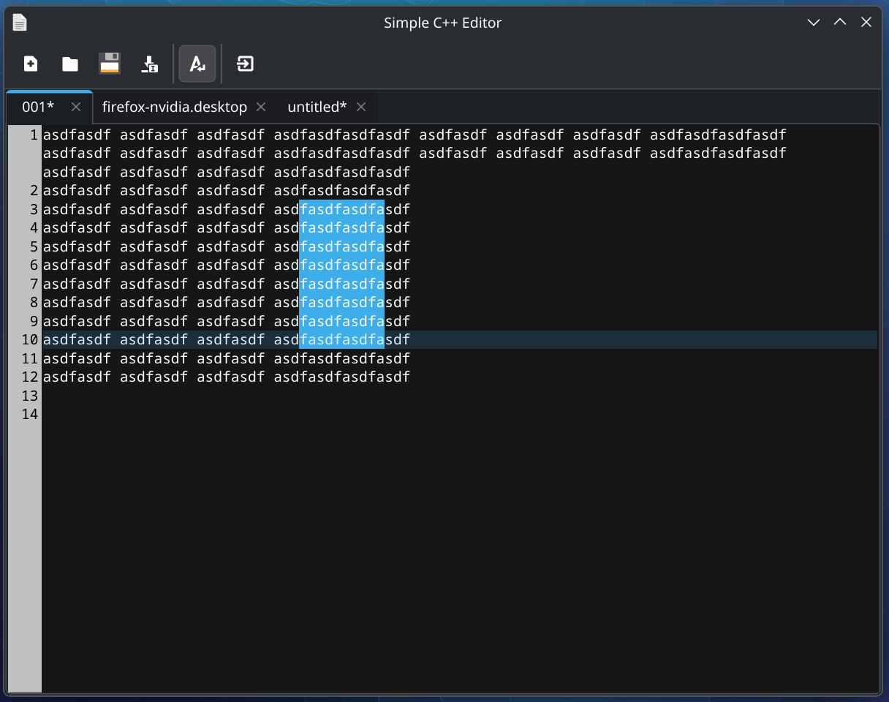

# Simple C++ Editor



Um editor de texto leve e funcional inspirado no Notepad++, desenvolvido em C++ com o framework Qt6 e o motor Scintilla.

## Funcionalidades

- **Múltiplas Abas:** Suporte para abrir vários arquivos simultaneamente.
- **Modo Coluna (Seleção em Bloco):** Segure `Alt` e arraste o mouse ou use `Alt+Shift+Setas` para selecionar e editar texto verticalmente (igual ao Notepad++).
- **Persistência de Sessão:** Ao fechar o editor, ele lembra quais abas estavam abertas e restaura até mesmo o conteúdo que não foi salvo em arquivo.
- **Drag and Drop:** Arraste arquivos diretamente para o editor para abri-los.
- **Interface Minimalista:** Toolbar baseada em ícones (Novo, Abrir, Salvar, Salvar Como, Sair) sem menus redundantes.
- **Numeração de Linhas:** Exibição nativa de linhas e destaque da linha atual.

## Pré-requisitos (Importante)

Para compilar e rodar este projeto, você precisa instalar o Qt6 e a biblioteca QScintilla2 para Qt6. No **Arch Linux**, execute:

```bash
sudo pacman -S qt6-base qscintilla-qt6 cmake base-devel
```

## Como Buildar e Rodar

O projeto inclui scripts facilitadores na pasta `scripts/`:

1. **Compilar:**
   ```bash
   ./scripts/build.sh
   ```
2. **Executar:**
   ```bash
   ./scripts/run.sh
   ```

## Instalação no Sistema (Menu de Contexto)

Para que o editor apareça no menu "Abrir com..." (Open With) do seu Linux e tenha um ícone no menu de aplicativos, você pode usar o script de instalação:

```bash
sudo ./scripts/install.sh
```

Isso criará uma entrada de desktop e instalará o binário em `/usr/local/bin`.
